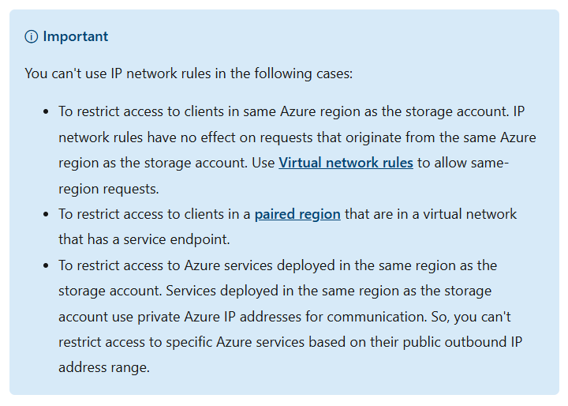
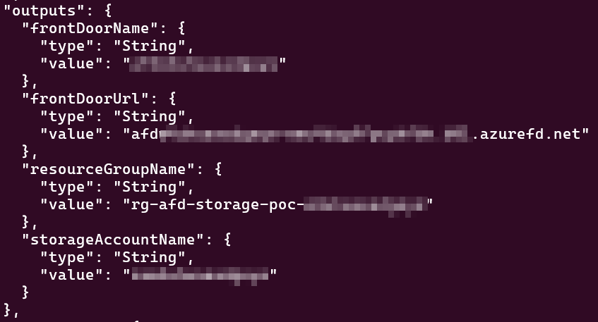
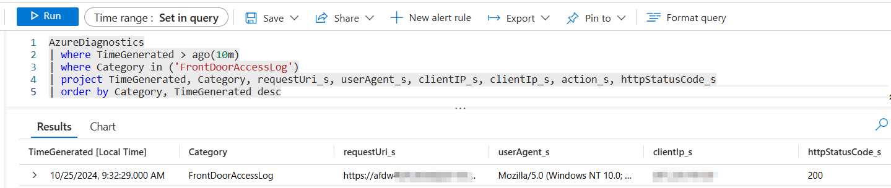
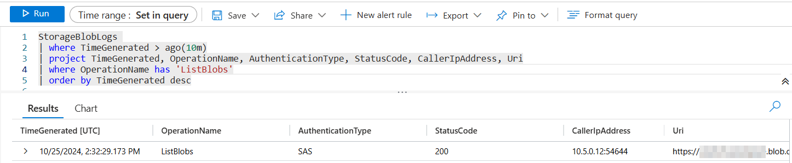

# Azure Storage Fronted by Azure Front Door

## Overview

When an Azure Storage Account is accessed by another Azure resource in the same region, traffic ingresses via an RFC-1918 IP address. This presents an issue if you want to restrict access to the Storage Account - you can't use the Storage Account's IP firewall feature since that only allows public IP addresses. And you can't use "selected virtual networks" since the RFC-1918 address in question isn't on your VNet.

From: <https://learn.microsoft.com/en-us/azure/storage/common/storage-network-security?tabs=azure-portal#grant-access-from-an-internet-ip-range>



Proxying requests from Azure Front Door to the Storage Account will allow you to restrict access to the storage account via Private Endpoints and then restrict access to the Front Door via WAF Rules.


## Instructions

1. Deploy resources

    ```bash
    az deployment sub create --location centralus --template-file main.bicep
    ```

    By default all IP addresses will be allowed by the WAF Policy. If you'd like to block everything but your IP, either edit the WAF Policy after it's deployed, or deploy as follows. 

    ```bash
    az deployment sub create --location centralus --template-file main.bicep --parameters allowedIpAddresses='("1.2.3.4",)'
    ```

    Note the trailing comma in the parameter value -- this is required if you are passing an array with a single value, otherwise the CLI will convert the value to a string and the deployment will fail.

    If you're running from a Windows command prompt instead of Linux, the syntax is slightly different:

    ```bash
    az deployment sub create --location centralus --template-file main.bicep --parameters allowedIpAddresses="['1.2.3.4']"
    ```

    Make sure to `az login` and `az account set` in order to choose the appropriate Azure subscription.

    This will deploy to a resource group called "rg-afd-storage-poc" with a unique string appended. (E.g. rg-afd-storage-poc-w4uhuaeadgeye). The same unique string will be appended to the storage account front door and log analytics workspace resource names. Both the AFD instance and the Storage Account will be configured to send diagnostic logs to the Log Analytics Workspace.

    The Storage Account network settings will be set to disable public network access -- only private endpoint access will be allowed in order to restrict ingress to the AFD instance.

2. Get the front door url from arm deployment output

    
3. Approve storage account private endpoint. If you don't approve the private endpoint then AFD will return a 504 Service Unavailable error on all requests.

    You can approve it via the following command (you can get the values for RESOURCE_GROUP and STORAGE_ACCOUNT_NAME from the ARM output):

    ```bash
    RESOURCE_GROUP=rg-afd-storage-poc-xxxxxxxxx
    STORAGE_ACCOUNT_NAME=xxxxxxxxx

    az network private-endpoint-connection approve --resource-group $RESOURCE_GROUP --name $(az network private-endpoint-connection list --resource-group $RESOURCE_GROUP --name $STORAGE_ACCOUNT_NAME --type Microsoft.Storage/storageAccounts | jq -r '.[0].name') --resource-name $STORAGE_ACCOUNT_NAME --type Microsoft.Storage/storageAccounts --description "Approved"
    ```

4. Get a sas token from the storage account

    
5. List contents of data container in storage account via front door url

    ```bash
    curl -X GET -H "x-ms-version: 2019-12-12" "https://{frontDoorUrl}/data?restype=container&comp=list&{sasToken}"
    ```

    This should produce something like the following: 

    ```xml
    <?xml version="1.0" encoding="utf-8"?><EnumerationResults ServiceEndpoint="https://xxxx.blob.core.windows.net/" ContainerName="data"><Blobs /><NextMarker /></EnumerationResults>
    ```

You can validate that things are working as expected via Log Analytics using the following queries:

```kql
AzureDiagnostics
| where TimeGenerated > ago(10m)
| where Category in ('FrontDoorAccessLog')
| project TimeGenerated, Category, requestUri_s, userAgent_s, clientIP_s, clientIp_s, action_s, httpStatusCode_s
| order by Category, TimeGenerated desc
```

Here you can see that requests come into AFD using your public ip address:



```kql
StorageBlobLogs 
| where TimeGenerated > ago(10m)
| project TimeGenerated, OperationName, AuthenticationType, StatusCode, CallerIpAddress, Uri
| where OperationName has 'ListBlobs'
| order by TimeGenerated desc
```

And here you can see that the storage account sees the ip address of the private endpoint from AFD:

