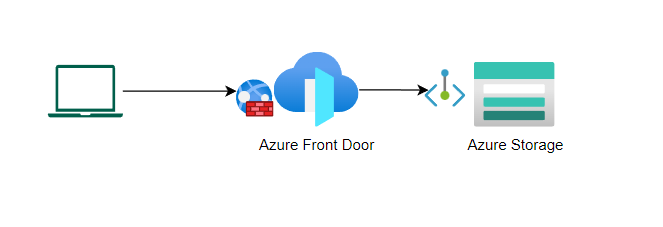

# Azure Storage Fronted by Azure Front Door

## Overview



## Instructions

1. Deploy resources

    ```bash
    az deployment sub create --location centralus --template-file main.bicep
    ```

    By default all IP addresses will be blocked by the WAF Policy. If you'd like to allow your IP through, either edit the WAF Policy after it's deployed, or deploy as follows. Note the trailing comma in the parameter value -- this is required if you are passing an array with a single value, otherwise the CLI will convert the value to a string and the deployment will fail.

    ```bash
    az deployment sub create --location centralus --template-file main.bicep --parameters allowedIpAddresses='("1.2.3.4",)'
    ```

    Make sure to `az login` and `az account set` in order to choose the appropriate Azure subscription.

    This will deploy to a resource group called "rg-afd-storage-poc" with a unique string appended. (E.g. rg-afd-storage-poc-w4uhuaeadgeye). The same unique string will be appended to the storage account and front door resource names.

2. Get the front door url from arm deployment output

    
3. Approve storage account private endpoint
4. Get a sas token from the storage account

    
5. List contents of data container in storage account via front door url

    ```bash
    curl -X GET -H "x-ms-version: 2019-12-12" "https://{frontDoorUrl}/data?restype=container&comp=list&{sasToken}"
    ```

    This should produce something like the following: 

    ```xml
    <?xml version="1.0" encoding="utf-8"?><EnumerationResults ServiceEndpoint="https://xxxx.blob.core.windows.net/" ContainerName="data"><Blobs /><NextMarker /></EnumerationResults>
    ```
